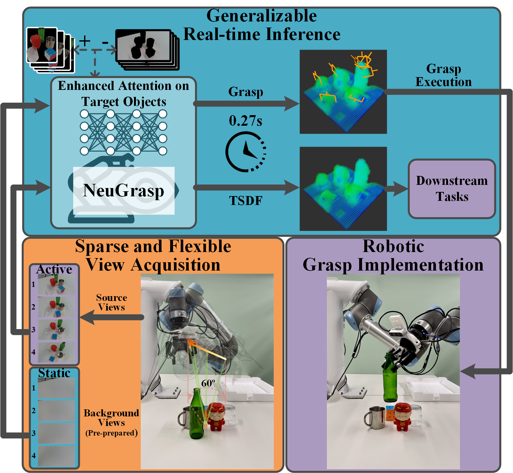

<div align="center">
    <h1> 
       NeuGrasp
    </h1>
    <h2>Generalizable Neural Surface Reconstruction with Background Priors for Material-Agnostic Object Grasp Detection
    </h2>
    <strong>ICRA 2025</strong>
    <br>
        <a href="https://fanqyu.github.io/" target="_blank">Qingyu Fan</a><sup>1,2,3</sup>,
        <a href="https://sites.google.com/site/caiyinghao" target="_blank">Yinghao Cai</a><sup>1,2†</sup>,
        Chao Li<sup>3</sup>,
        Wenzhe He<sup>3</sup>,
        <br>
        Xudong Zheng<sup>3</sup>,
        Tao Lu<sup>1</sup>,
        <a href="https://scholar.google.com/citations?hl=zh-CN&user=mpchz3sAAAAJ" target="_blank">Bin Liang</a><sup>3</sup>,
        <a href="https://scholar.google.com/citations?hl=zh-CN&user=XL9j2UUAAAAJ" target="_blank">Shuo Wang</a><sup>1,2</sup>
        <p>
        <h45>
            <sup>1</sup> Institute of Automation, Chinese Academy of Sciences. &nbsp;&nbsp;
            <br>
            <sup>2</sup> School of Artificial Intelligence, University of Chinese Academy of Sciences. &nbsp;&nbsp;
            <br>
            <sup>3</sup> Qiyuan Lab. &nbsp;&nbsp;
            <br>
        </h45>
        <sup>†</sup>Corresponding Authors
    </p>
    <!-- <a href="https://ieeexplore.ieee.org/abstract/document/10801474"></a> -->
    <a href="https://arxiv.org/abs/2503.03511"></a>
    <a href='https://neugrasp.github.io/'></a>
    <a href="https://youtu.be/jnJgKZYgt28?si=loh9tbxxXPMEwTuW"></a>
</div>

## 📢 News

- **[05/09/2025]**: The code of **NeuGrasp** is released. 
- **[01/31/2025]**: **NeuGrasp** is accepted to ICRA 2025. 

## 📜 Introduction

**[ICRA'25]** This is the official repository of **NeuGrasp: Generalizable Neural Surface Reconstruction with Background Priors for Material-Agnostic Object Grasp Detection**.



In this paper, we introduce **NeuGrasp**, a **neural surface reconstruction** method that leverages background priors for material-agnostic grasp detection. NeuGrasp integrates transformers and global prior volumes to aggregate multi-view features with spatial encoding, enabling robust surface reconstruction in **narrow and sparse viewing conditions**. By focusing on foreground objects through residual feature enhancement and refining spatial perception with an occupancy-prior volume, NeuGrasp excels in handling objects with **transparent and specular** surfaces.

Please kindly star ⭐️ this project if it helps you 😁.

## 🛠️ Installation

### ✅ Prerequisites

* **ROS** — Required for grasp and scene visualization.
* **Blender 2.93.3** — Used for simulation and synthetic data generation.
  You can download it from the [official Blender website](https://www.blender.org/download/releases/2-93/).

### 📦 Dependencies

To install the required Python packages, run:

```bash
pip install -r requirements.txt
```

> ⚠️ **Blender Python Dependencies**
> Please ensure Blender is properly installed and accessible from the command line (i.e., the `blender` command works).
> Additionally, note that **Blender uses its own bundled Python environment** for simulation scripts. You need to install the required packages within Blender's Python. Run the following commands to set it up:

```bash
/path/to/blender-2.93.3-linux-x64/2.93/python/bin/python3.9 -m ensurepip --upgrade
/path/to/blender-2.93.3-linux-x64/2.93/python/bin/python3.9 -m pip install -r requirements.txt
```

> 🔁 Replace `/path/to/` with your actual Blender installation path.

## 🚀 Quick Start

### 📝 Modify Paths

Before running the code, please ensure that all file and directory paths in the scripts (e.g., Blender path, dataset path, save directories) are correctly set according to your local environment.

For example, update:

```python
BLENDER_PATH = "/path/to/blender-2.93.3-linux-x64/blender"
PYTHON_PATH = "/path/to/python"
```

> 🔁 Replace `/path/to/` with your actual working directory.

### 🧪 Data Generation

1. Download and extract the required [assets](https://drive.google.com/file/d/15tTlmmYhn1BuuPoOtzoX6BYe9T7VWvuO/view?usp=sharing) into `data/`.
2. Download the [ImageNet 2012 test set](https://www.image-net.org/challenges/LSVRC/2012/) and organize as `src/assets/imagenet/images/test`. This is used for randomized texture assignment during simulation.
3. Download scene descriptor files from [GIGA](https://github.com/UT-Austin-RPL/GIGA#pre-generated-data) into `data/NeuGraspData/data/`.
4. Download and extract the [renderer module](https://drive.google.com/file/d/1q_VKxhYXvbkiTjwtoGni-YCGIjtdIK0p/view?usp=sharing) to `data_generator/render/`.

You can also download [example generated data](https://drive.google.com/file/d/11SfPu-wE99RLMhLTjfyqi-bH4z09JmvZ/view?usp=sharing) for reference

Once all resources are prepared, run the following:

```bash
cd data_generator/render
bash run_packed_rand.sh
```

> 💡 For pile scenes and background data, follow the same procedure.

After rendering is complete, process the raw data using:

```bash
python data_generator/render/wash.py
python data_generator/render/depth2tsdf.py
```

These scripts will clean up the data and convert the rendered depth images into `.npz` TSDF files for downstream use.

### 🏋️ Training

Once the training data and configuration files are ready, run the following command:

```bash
bash train.sh GPU_ID
```

For example:

```bash
bash train.sh 0
```

### 🔍 Testing

We provide pretrained weights for direct evaluation. Please download the [checkpoint](https://drive.google.com/file/d/1SRkIdJTcQBCMHZ7gISGVSazb1YBtLC13/view?usp=sharing) and place it in:

```
src/neugrasp/ckpt/
```

To run simulation-based grasping:

```bash
bash run_simgrasp.sh
```

### 🔭 Visualization Options

* **RViz Visualization**
  To visualize the scene and predicted grasps in RViz, set `RVIZ=1` in the configuration, and run the following commands beforehand:

  ```bash
  roscore
  rviz
  ```

  Then, in the RViz interface, open the config file:

  ```bash
  src/gd/config/sim.rviz
  ```

* **PyBullet Execution**
  To visualize grasp execution in PyBullet, set `GUI=1`.

## 🔧 Finetuning with Real-World Data

Our method is robust without geometry ground truth and can be further improved by finetuning on real-world data.

* We provide [our collected data](todo) and partial scripts for reference.
* Due to the complexity of hardware setups, we only offer **guidelines** for real-world data collection.

### 🛠️ Real-World Data Collection Procedure

1. The robot captures RGB-D images at the start of each scene.
2. A human operator manually moves the arm to feasible grasp positions.
3. Another person inputs `yes`, triggering the gripper to close and saving the grasp pose and width.

We recommend rewriting a collection script tailored to your setup. Useful reference functions can be found in the [VGN repository](https://github.com/ethz-asl/vgn).

## 📚 Citation

If you find our work helpful, please consider citing:

```bibtex
@inproceedings{fan2025neugrasp,
  title={NeuGrasp: Generalizable Neural Surface Reconstruction with Background Priors for Material-Agnostic Object Grasp Detection},
  author={Fan, Qingyu and Cai, Yinghao and Li, Chao and He, Wenzhe and Zheng, Xudong and Lu, Tao and Liang, Bin and Wang, Shuo},
  booktitle={2025 IEEE International Conference on Robotics and Automation (ICRA)},
  organization={IEEE}
}
```

## 🙏 Acknowledgments

We would like to thank the authors of [VGN](https://github.com/ethz-asl/vgn) and [GraspNeRF](https://github.com/PKU-EPIC/GraspNeRF) for open-sourcing their codebases, which greatly inspired this work.

## 📬 Contact

For questions or feedback, feel free to open an issue or reach out:

* Qingyu Fan: `fanqingyu23@mails.ucas.ac.cn`
* Yinghao Cai: `yinghao.cai@ia.ac.cn`
